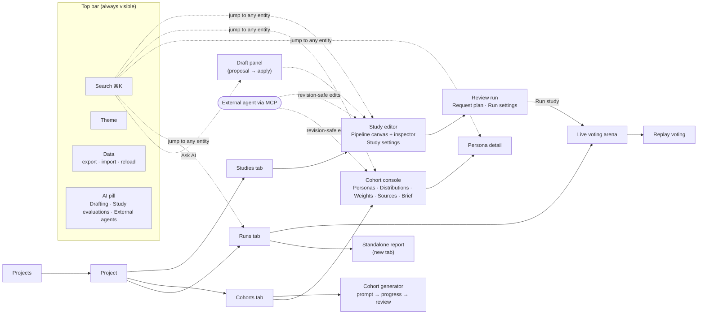
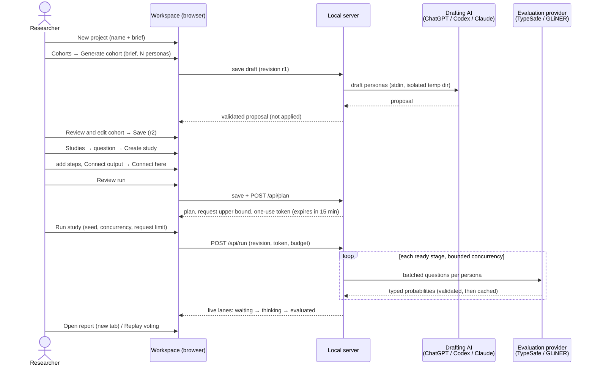
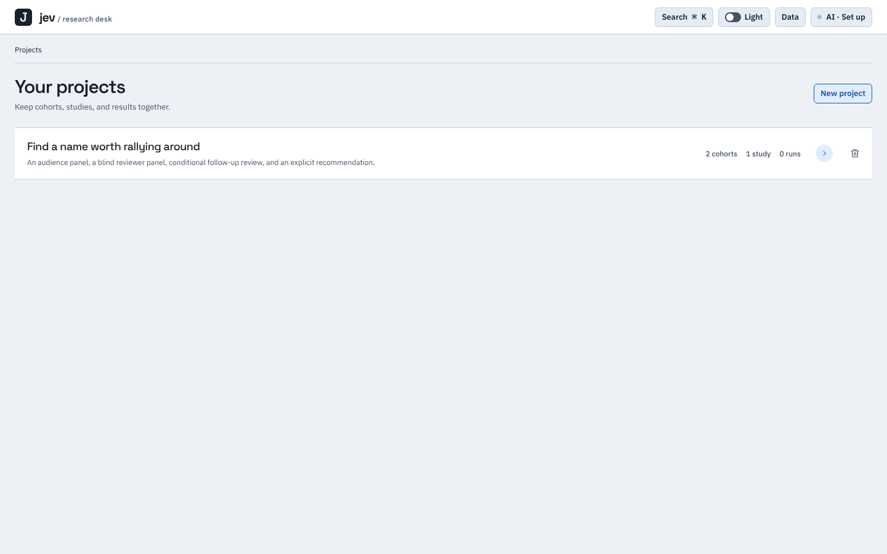
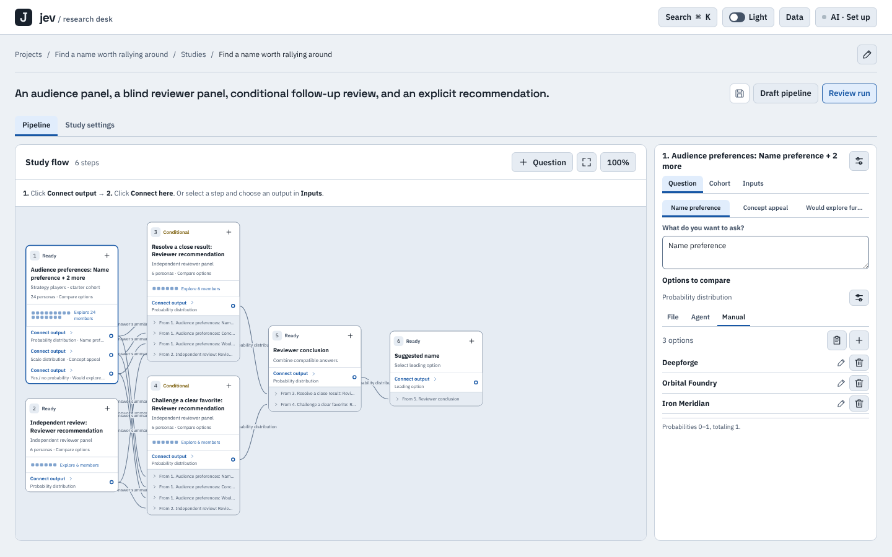
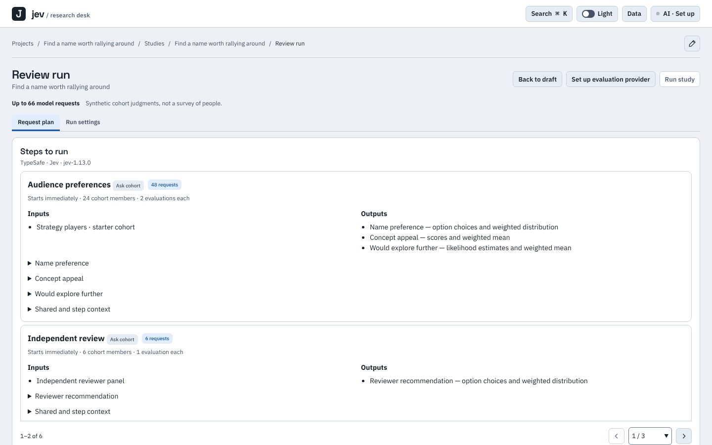
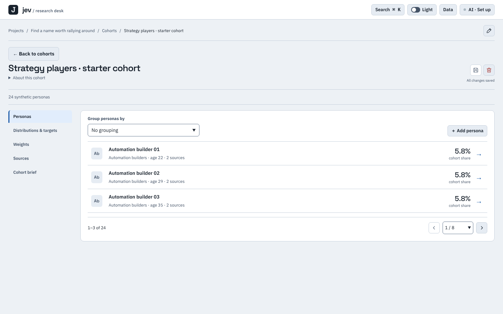
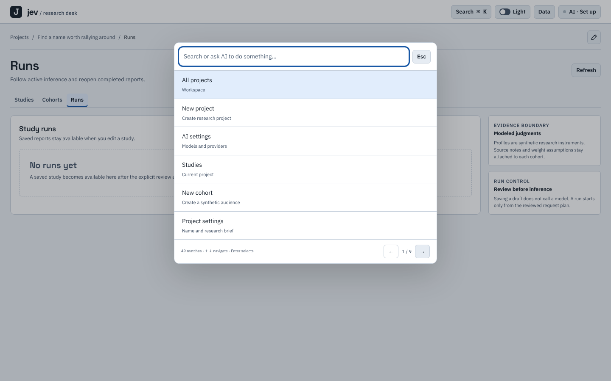
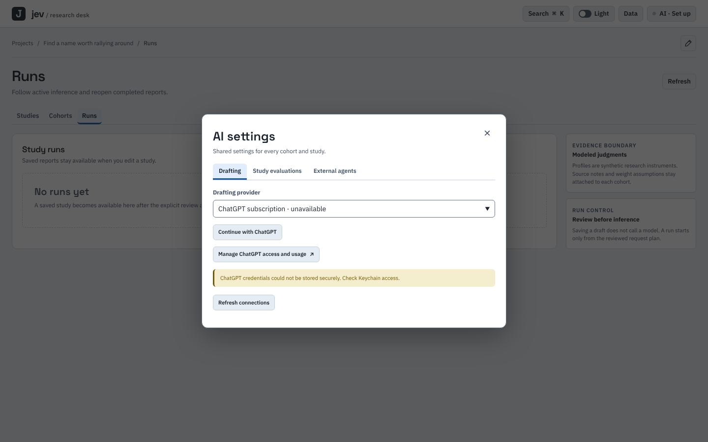
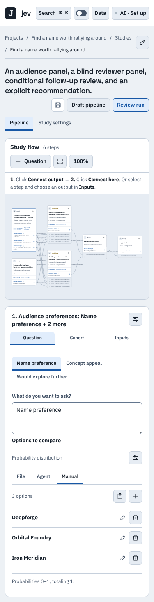
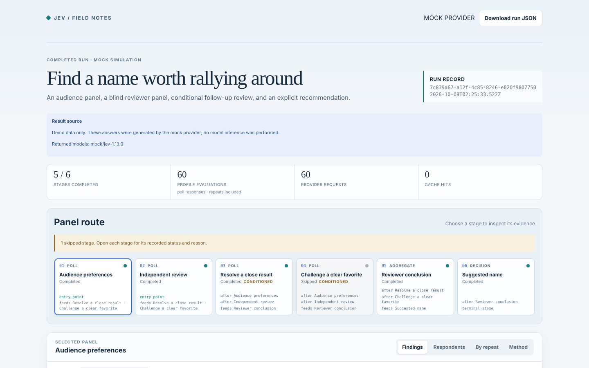

# UX and Flow Review: Jev Polls workspace

**Date**: 2026-10-09 · **Commit reviewed**: `098eefd` · **Spec**: [`jev-polls.spec`](../../jev-polls.spec/spec.yaml) (behavior IDs below are `area/behavior`)

How this was checked: the workspace was run locally (`jev-polls connect` with the opt-in
`game-naming` example), walked with a headless browser at 1440px and 375px, and the UI source
was read end to end. Each finding has a code reference. **C** means confirmed in code or on
screen. **I** means inferred from code and not reproduced live.

## 1. Map of the product

There is **no URL routing**. Every view lives in in-memory state (`src/workspace-ui.ts:75`),
so a reload returns to Projects, the back button leaves the app, and no view can be linked to.
The only server pages are `/`, `/reports/:id` and `/report` (`src/workspace.ts:263,368`).

## 2. The core journey: from question to result

Three gates protect inference: a **saved revision**, a **one-use plan token**, and a
**request budget**. This is the strongest part of the design. The spec keeps it as
`review-and-run/no-implicit-inference` and `review-and-run/run-gate`.

## 3. Screens as they are today

| Projects | Study editor (1440px) |
|---|---|
|  |  |
| **Review run** | **Cohort console** |
|  |  |
| **Command palette** | **AI settings** |
|  |  |
| **Study editor at 375px** | **Standalone report (mock run)** |
|  |  |

## 4. Findings, ranked

### High: correctness and trust

| # | Finding | Evidence | Type |
|---|---|---|---|
| H1 | If an agent edits the workspace while the user's draft is dirty, the review plan is silently cleared without a re-render. Clicking **Run study** then says *"Set up the evaluation provider before running."* That is the wrong reason. | `workspace-ui.ts:417` sets `S.plan=null`. `beginRun` throws on `!S.plan` (`:437`). | C |
| H2 | Conflicts have no merge path. The only options are to export, to reload (which discards the user's edits), or to re-import (which overwrites the agent's edits). When the draft is clean, agent edits replace the view with no notice. | `workspace-ui.ts:415,417,430,439` | C |
| H3 | A running study cannot be cancelled. There is no route and no button, and only one run is allowed at a time. | `workspace.ts` (`RUN_IN_PROGRESS`), `workspace-ui.ts:349` | C |
| H4 | The request limit accepts any value of 1 or more, but the server rejects a budget below the plan (`BUDGET_TOO_SMALL`). The minimum is never shown. | `workspace-ui.ts:380,437` | C |
| H5 | Errors raised inside modals (TypeSafe key, import) appear in a page banner behind the modal. | `workspace-ui.ts:446,439` | C |
| H6 | The default drafting provider is **"ChatGPT subscription · unavailable"**, even when Claude Code shows as *ready* in the same list. | Screenshot `08-ai.png` | C |

### Medium: flow friction

| # | Finding | Evidence | Type |
|---|---|---|---|
| M1 | **Cohort personas are paginated 3 per page.** At 1440×900 more than half the panel is empty. The page picker lists every page, so a 20,000-persona cohort would offer about 6,667 options. | `cohort-explorer-ui.ts:45`, `workspace-navigation-ui.ts:33`, `12-cohort.png` | C |
| M2 | **The flow canvas is unreadable at 375px.** It scales to fit, so node text renders at about 4px. At 1440px, edge labels such as "answer summary" are clipped behind nodes. | `15-m-study.png`, `04-study.png` | C |
| M3 | **There are two commit layers.** Each section has its own "Apply …" button, forms auto-flush on most clicks, and an icon-only Save is still required. There is no Ctrl+S. Deleting a project shows "Save changes to keep the deletion." | `workspace-ui.ts:97,434,445`, `project-deletion-ui.ts:133` | C |
| M4 | **Destructive actions have no confirmation or undo**: remove step, persona, segment, source, question or target; disconnect an input; "Use these options" (which replaces all options). The only recovery is "Reload saved", which drops every unsaved edit. The cohort Save and Delete icons sit next to each other. | `option-agent-ui.ts:105`, `12-cohort.png` | C |
| M5 | **One study per project is enforced** ("This project already has a study"), yet the README, the guide and a 6-per-page study list all imply several. | `workspace-ui.ts:148,446` | C |
| M6 | **Five names for one concept.** README says *phase*, browser says *step*, report says *stage* and *Panel route*, buttons say *pipeline*, CLI says *stage*. Separately, *study* and *pipeline* name the same thing. | README, `04-study.png`, `16-report.png` | C |
| M7 | **README labels don't exist in the code**: "Add next phase", "Edit question & cohort", "Create study" (the Studies header shows "Draft pipeline"). | grep of `src/` | C |
| M8 | **There is no busy state while the plan is computed**, so repeat clicks are possible. "Preparing run plan" can never render. Run polling stops for good after a single fetch error. | `workspace-ui.ts:375,418,436,438` | C |
| M9 | **Cmd+K paginates 6 results** (1/9 pages with 49 matches) instead of scrolling. That is unusual for a palette and slows keyboard users. | `workspace-command-ui.ts:28`, `10-cmdk.png` | C |
| M10 | **"Draft with assistant" on the empty Cohorts view opens the pipeline panel** ("What should this pipeline do?"). | `workspace-ui.ts:341,442` | C |

### Low: polish and design-direction drift

| # | Finding | Evidence |
|---|---|---|
| L1 | Primary actions are blue, but the design direction says **orange**. There is no `prefers-color-scheme`, and `<meta color-scheme="light">` is set. | `workspace-theme.ts:38,86`, `workspace-ui.ts:24` |
| L2 | Desktop controls are 32px and fields 36px; flow buttons are 24–26px. The 44px rule applies only when `pointer:coarse`. | `workspace-theme.ts:62,118`, `workspace-flow-ui.ts:193` |
| L3 | The report uses a different visual language ("Field notes": serif headline, teal accent) from the workspace ("instrument panel"). | `16-report.png` |
| L4 | The study heading shows the description, not the study name. The breadcrumb repeats the project name for the study. | `04-study.png` |
| L5 | Named inputs are auto-keyed `answer_N` and can only be renamed in Advanced. Users see titles, but questions must reference `inputs.<name>`. | `workspace-flow-ui.ts:35`, `study-setup-ui.ts:116` |
| L6 | Persona attributes, shared context and step context are edited as raw JSON. | `cohort-explorer-ui.ts:55`, `workspace-ui.ts:163,189` |
| L7 | There is dead UI: the hidden Assistant tab and the "phase" study wizard are unreachable. | `workspace-ui.ts:392,442`, `study-setup-ui.ts:70-80` |
| L8 | The shortcut shows "⌘ K" on every OS. The replay slider updates on `change`, not `input`. | `workspace-ui.ts:27`, `workspace-arena-controls.ts:105` |
| L9 | Credentials need the macOS Keychain. On Linux, ChatGPT sign-in fails with "could not be stored securely". The README says macOS only; the UI doesn't say so. | `08-ai.png` |

## 5. Open proposals (not accepted intent)

1. **One save model.** Autosave drafts per entity, add explicit undo, and drop the per-section "Apply". Saving never runs inference, so autosave is safe (`review-and-run/no-implicit-inference`).
2. **URL-addressable views**, so reload, back and deep links work.
3. **Conflict UX**: announce remote changes, show which entities changed, and let the user keep theirs, take the remote version, or merge per entity.
4. **Run control**: add cancel, a visible minimum budget, a busy state while planning, and resilient polling.
5. **One vocabulary**: *Project → Study → Step → Question*, with Cohort and Persona. Keep `stage` only in the JSON and CLI contracts.
6. **Density**: show at least 12 to 25 persona rows per page and use page-number input instead of a full option list. Show the canvas as a vertical list below 768px.
7. Decide whether a project holds **one study or many**, then align the UI and docs.

## 6. Engine and contract findings

These come from the core modules, the CLI, MCP and the tests. All are confirmed in code. E2 and E4 were also reproduced by running them.

| # | Severity | Finding | Evidence |
|---|---|---|---|
| E1 | High | **A 20,000-persona cohort cannot be saved through the browser.** The HTTP body cap is 5 MiB, while the store allows 20 MiB. The README advertises 20,000 personas as "the workspace storage limit". | `workspace.ts:190,388` vs `workspace-store.ts:11`, `limits.ts:3` |
| E2 | Med-high | **Target allocation crashes or leaves a slot empty when percentages total 100 ± 0.01 but not exactly 100.** For example, [60.005, 40.004] at size 20,000 crashes with `Cannot read properties of undefined`. | `cohort-insights.ts:78,207-222`, `local-agent.ts:511` |
| E3 | Medium | **A Final result step under an `any` join fails the whole run when its source was skipped.** A Combine answers step in the same position is skipped instead. | `engine.ts:363-368` vs `:373-376`, `:422` |
| E4 | Medium | **Hashes depend on the OS locale.** `stableStringify` sorts with `localeCompare`, so `['y','j','k']` sorts differently under en-US and lt-LT. Pipeline hashes, cache keys and seeds can therefore differ between machines, and `parseRun` rejects a valid run. | `engine-utils.ts:8`, `run-record.ts:298` |
| E5 | Medium | **The schema and the engine follow different condition rules.** The engine accepts any ancestor and allows `winner` and `topProbability` on Score. The schema allows only direct dependencies and limits those metrics to Choice. The docs disagree with each other too. | `schema.ts:101-110` vs `engine.ts:513-526` |
| E6 | Medium | **CLI `run` has no budget pre-check.** The default `--max-requests` is 1000. Larger studies use up the budget and then fail personas partway through. | `cli.ts:149` |
| E7 | Low-med | **The agent guide's MCP steps omit `save_project` and `projectId`**, so a new project fails with PROJECT_REQUIRED. | `mcp.ts:110-111`, `docs/agent-guide.md` |
| E8 | Low | **The TypeSafe cache key omits the endpoint.** | `provider.ts:230-263`, `engine.ts:324` |
| E9 | Low | **The name `sharedContext` actually carries persona attributes.** | `engine.ts:310-313` |
| E10 | Low | **Draft limits differ from runnable limits** (age 0–120 vs 18–120, score levels 255 vs 10). This is intentional, and the `cohorts` area prose now documents it. | `workspace-store.ts:12-23` |
| E11 | Low | **Small mismatches:** `report --out` overwrites without asking. Off macOS, `auth set` spends a live request and then cannot save. `staleLockState` is dead code. | `cli.ts`, `auth.ts`, `workspace-store.ts:518` |

**Test gaps**: Host-header and DNS-rebinding rejection, plan-token expiry and eviction, BUDGET_TOO_SMALL, large-cohort save over HTTP, target totals within tolerance, Final result under an `any` join, locale-independent hashing, and `report --out` overwrite.

## 7. Reconciliation against the spec

Status at commit `098eefd`. **Gap** means the code contradicts the behavior. Every behavior not
listed here was traced in code or tests without a contradiction. That makes it unverified rather
than satisfied, because no live TypeSafe run was made.

| Behavior ID | Status | Finding |
|---|---|---|
| `projects/storage-limits` | gap | E1 |
| `cohorts/distribution-targets` | gap | E2 |
| `execution/skipped-source-skips` | gap | E3 |
| `execution/locale-independent-hashes` | gap | E4 |
| `studies/branches-and-joins` | gap | E5 |
| `cli/budget-precheck` | gap | E6 |
| `agent-collaboration/guide-covers-projects` | gap | E7 |
| `execution/exact-response-cache` | gap | E8 |
| `cli/protect-artifacts`, `credentials-and-security/verify-then-save` | gap | E11 |
| `review-and-run/stale-plan-explained` | gap | H1 |
| `agent-collaboration/clean-draft-sync`, `agent-collaboration/field-level-merge`, `agent-collaboration/refresh-keeps-draft`, `agent-collaboration/save-conflict-resolution` | gap | H2 |
| `review-and-run/budget-minimum-visible` | gap | H4 |
| `interface-quality/errors-in-context` | gap | H5 |
| `drafting/ready-provider-default` | gap | H6 |
| `cohorts/persona-browsing` | gap | M1 |
| `interface-quality/responsive-no-clipping` | gap | M2 |
| `interface-quality/destructive-actions-recoverable` | gap | M4 |
| `vocabulary/one-term-per-concept`, `vocabulary/documented-labels-exist` | gap | M6, M7 |
| `review-and-run/plan-busy-state`, `live-and-replay/resilient-polling` | gap | M8 |
| `navigation/command-palette` | gap | M9 |
| `drafting/context-matched-panel` | gap | M10 |
| `interface-quality/theme-and-accent` | gap | L1 |
| `interface-quality/target-size` | gap | L2 |
| `reports/consistent-style` | gap | L3 |
| `studies/named-inputs-visible` | gap | L5 |
| `studies/structured-context` | gap | L6 |
| `interface-quality/no-dead-ui` | gap | L7 |
| `navigation/platform-shortcut-hint`, `live-and-replay/replay-controls` | gap | L8 |
| `drafting/unsupported-credential-store` | gap | L9 |

The following are **open decisions** and are labeled as proposals in the area prose: one study or
many per project (M5), the save model (M3), run
cancellation (H3), and URL routing (§1).
