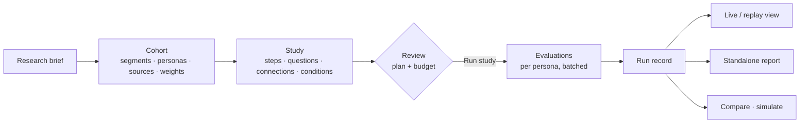
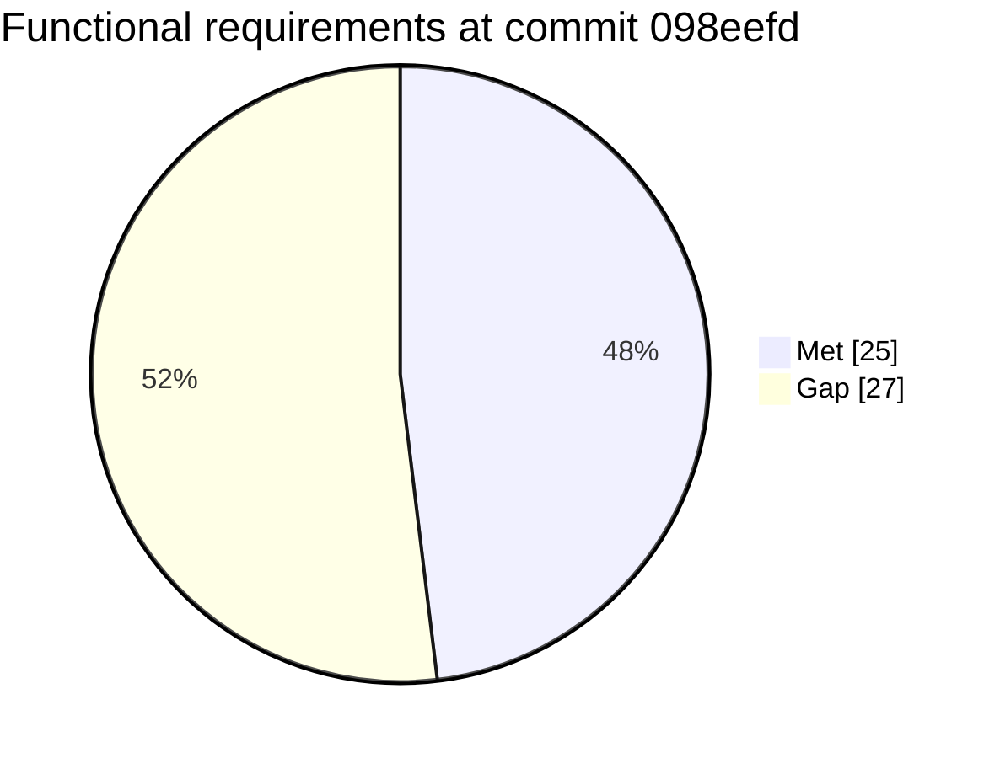

# Feature Specification: Jev Polls Workspace Baseline

**Feature Branch**: `spec/001-workspace-baseline`

**Created**: 2026-10-09

**Status**: Draft (3 clarifications open)

**Input**: User description: "Review repo, UX and flows, use specify to make sure we have a well-defined spec"

> This is a **baseline spec** for the product as built at commit `098eefd`. It covers
> what Jev Polls must do, what each user flow is, and where today's behaviour falls short.
> Requirements marked **[GAP]** are not met today. Each gap links to evidence in
> [ux-review.md](./ux-review.md) (UX findings H/M/L) or to the engine findings in
> [ux-review.md §6](./ux-review.md#6-engine-and-contract-findings). Principles come from
> [the constitution](../../.specify/memory/constitution.md).

## Overview

Jev Polls is a local research instrument. A researcher defines **synthetic cohorts** of
adult personas, asks them typed questions through a **study** made of connected **steps**,
and inspects weighted, uncertainty-preserving results. Drafting help comes from the user's
own AI login. Live evaluation comes from an explicitly chosen provider. Everything stays
on the user's machine.

### Where the product stands today

| Area | Requirements | Met today | Gaps |
|---|---|---|---|
| Projects & persistence | 7 | 5 | 2 |
| Cohorts | 7 | 3 | 4 |
| Studies | 6 | 4 | 2 |
| Review & run | 9 | 4 | 5 |
| Results | 5 | 3 | 2 |
| AI, credentials, agents | 6 | 3 | 3 |
| Interface quality | 8 | 1 | 7 |
| CLI | 4 | 2 | 2 |
| **Total** | **52** | **25** | **27** |

The engine, security and evidence-honesty rules are largely met. The gaps cluster in
**interface quality**, **review and run control**, and **agent collaboration**.

### Vocabulary (normative)

| User-facing term | Meaning | Contract term (JSON/CLI) |
|---|---|---|
| Project | Container for one decision: brief, cohorts, studies, runs | `projects[]` |
| Cohort | Weighted set of adult synthetic personas with sources | `cohort` |
| Persona | One synthetic adult profile | `persona` |
| Segment | Weighted group of personas | `segment` |
| Study | Directed acyclic flow of steps | `pipeline` |
| Step | One node: Ask cohort, Combine answers, or Final result | `stage` (`poll`, `aggregate`, `decision`) |
| Question | Typed ask: Choice, Score, or Yes/No | `question` (`choice`, `score`, `noul`) |
| Input | Named earlier result passed into a step | `inputs.<name>` |
| Run | One execution of a reviewed study revision | `RunRecord` |

The UI, README, guide and report MUST use only the user-facing terms. "Phase", "panel" and
"pipeline" MUST NOT appear in user-facing copy. **[GAP: M6, M7]**

## Clarifications

### Session 2026-10-09 (open)

- Q1: How many studies may a project hold? → [NEEDS CLARIFICATION: one study per project (as enforced today) or many (as README and the study list imply)?]
- Q2: What is the save model? → [NEEDS CLARIFICATION: autosave with undo, or explicit Save with one dirty indicator, replacing today's mix of per-section "Apply" and an icon-only Save?]
- Q3: What happens when an agent edits the workspace while the user has unsaved edits? → [NEEDS CLARIFICATION: per-entity choice of keep mine / take theirs, or block the agent write until the user saves?]

## User Scenarios & Testing *(mandatory)*

### User Story 1 - Build a cohort from a brief (Priority: P1)

A researcher describes an audience in a sentence, picks a persona count, and gets an
editable cohort. Every trait shows whether it is sourced or synthetic, and every segment
weight states its basis.

**Why this priority**: No study can run without a cohort. It is also where evidence
honesty is won or lost.

**Independent Test**: In an empty project, generate a 24-persona cohort, edit one persona
and one segment weight, save, and reload. The edits persist, every persona shows its cohort
share, and sourced and synthetic fields are labeled.

**Acceptance Scenarios**:

1. **Given** an empty project with a ready drafting provider, **When** the user enters a brief and 24 personas and chooses Generate cohort, **Then** the current draft is saved first, progress shows real job counts and elapsed time, and a proposal appears that has not been applied.
2. **Given** a proposal, **When** the user chooses Review and edit cohort, **Then** the cohort opens editable and no other cohort or study has changed.
3. **Given** a proposal whose base revision has changed since generation, **When** the user tries to adopt it, **Then** adoption is refused with a message to regenerate.
4. **Given** a cohort with a `sourced` segment and no source, **When** the user reviews a study that uses it, **Then** review fails with a message naming the segment.
5. **Given** no drafting provider is ready, **When** the user opens the generator, **Then** Generate is disabled with the reason shown, and Create manually is available.

---

### User Story 2 - Design a study flow (Priority: P1)

The researcher states a question, picks a cohort, and adds steps. Steps can be follow-ups,
branches with conditions, joins that combine answers, or a final result. Earlier outputs
are passed in as named inputs.

**Why this priority**: The study graph is the product's distinctive capability.

**Independent Test**: Build the example shape (two entry steps → two conditional steps →
Combine answers → Final result) without editing JSON, then pass review.

**Acceptance Scenarios**:

1. **Given** a project with a cohort, **When** the user enters a question and chooses Create study, **Then** a study with one Ask cohort step opens on its canvas.
2. **Given** two steps, **When** the user chooses Connect output on step A and Connect here on step B, **Then** B gains a named input from A, and A becomes a dependency of B.
3. **Given** a connection that would create a cycle, or an incompatible projection, **When** the user tries it, **Then** it is refused with the reason.
4. **Given** a conditional step whose condition is false at run time, **When** the run executes, **Then** the step and its exclusive descendants are recorded as *skipped* with a reason, and the run can still complete.
5. **Given** a Final result step under an any-of join whose source was skipped, **When** the run executes, **Then** the step is *skipped*, not *failed*. **[GAP: E3]**

---

### User Story 3 - Review the plan and run with an explicit budget (Priority: P1)

Before any inference, the researcher sees each step's request count, the upper-bound
total, the provider and model, and the assumptions. The researcher then sets a seed,
concurrency and a request limit, and starts the run.

**Why this priority**: Spending money or quota only on purpose is a core promise
(Constitution II).

**Independent Test**: Review a study and check the bound equals Σ(size × repeats). Set
the request limit below the bound and confirm it is refused in the form. Run, then cancel.

**Acceptance Scenarios**:

1. **Given** a saved study, **When** the user chooses Review run, **Then** a busy state shows until the plan is ready, and repeat clicks are ignored. **[GAP: M8]**
2. **Given** a plan with an upper bound of 66, **When** the user sets the request limit to 50, **Then** the field shows "Minimum 66 for this plan" and Run study stays disabled. **[GAP: H4]**
3. **Given** a reviewed plan, **When** the saved revision changes (by the user or an agent), **Then** the review page says the plan is out of date and offers Review again. It never shows an unrelated error. **[GAP: H1]**
4. **Given** a plan older than its validity window, **When** the user chooses Run study, **Then** the UI says the review expired and offers Review again.
5. **Given** a running study, **When** the user chooses Cancel run, **Then** no new evaluations start, in-flight ones finish or abort, and the run is saved as *cancelled* with partial results labeled. **[GAP: H3]**
6. **Given** no evaluation provider is ready, **When** the user opens Review run, **Then** Run study is disabled and Set up evaluation provider is the primary action.

---

### User Story 4 - Watch, inspect and report results (Priority: P2)

During and after a run, the researcher watches personas move through waiting, thinking and
evaluated lanes, inspects any persona's typed answers, replays a finished run, and opens a
standalone report with distributions, segments, repeats and provenance.

**Why this priority**: Results are the payoff, but they depend on P1 stories.

**Independent Test**: Run a study and open Watch voting. Select a persona to see its answers.
Replay at 2×. Open the report offline and confirm no network requests.

**Acceptance Scenarios**:

1. **Given** a run in progress, **When** a status fetch fails once, **Then** polling retries with backoff and shows a reconnecting notice instead of stopping. **[GAP: M8]**
2. **Given** a finished run, **When** the user drags the replay slider, **Then** the view updates continuously while dragging. **[GAP: L8]**
3. **Given** any report, **Then** it states the provider and returned models, labels mock data as demo, labels simulation intervals as conditional on model outputs, and never calls repeats "people".
4. **Given** a report, **Then** it uses the workspace's visual language and vocabulary (Study, Step). **[GAP: L3, M6]**

---

### User Story 5 - Draft with AI assistance (Priority: P2)

The researcher picks a drafting provider (ChatGPT subscription, Codex or Claude Code) once.
They then ask in plain language for a cohort, a study, or an edit, and review a proposal
before applying it.

**Why this priority**: It speeds up setup, but every outcome can also be achieved manually.

**Independent Test**: With only Claude Code installed, open AI settings. Claude Code is
selected by default. Draft a study from Cmd+K → Ask AI, review it, apply it, and land on the
new study.

**Acceptance Scenarios**:

1. **Given** exactly one ready drafting provider, **When** AI settings opens for the first time, **Then** that provider is preselected. **[GAP: H6]**
2. **Given** the keychain is unavailable on this OS, **When** the user selects ChatGPT subscription, **Then** the UI says that sign-in requires a supported credential store and names the alternatives. **[GAP: L9]**
3. **Given** Draft with assistant chosen from the Cohorts view, **Then** the panel is cohort-focused, not pipeline-focused. **[GAP: M10]**
4. **Given** a proposal, **When** the user discards it, **Then** the workspace is unchanged.

---

### User Story 6 - Collaborate with an external agent via MCP (Priority: P2)

The researcher's own agent (Codex, Claude Code or another MCP client) reads the workspace,
saves cohorts and studies, reviews, and with an explicit plan token and budget, runs a study.
The browser stays consistent.

**Why this priority**: This is the documented primary workflow for research-heavy cohorts.

**Independent Test**: With a clean browser draft, have the agent save a cohort. The browser
shows a notice naming the change. With a dirty draft, have the agent save. The user resolves
it without losing either side.

**Acceptance Scenarios**:

1. **Given** a clean browser draft, **When** an agent saves, **Then** the browser updates and announces what changed. **[GAP: H2]**
2. **Given** a dirty browser draft, **When** an agent saves, **Then** the user is told which entities differ and can resolve per Q3 without exporting files. **[GAP: H2]**
3. **Given** the MCP adapter, **Then** it accepts only a loopback workspace URL, never returns credentials, and requires the reviewed revision, plan token and budget to run.

---

### User Story 7 - Navigate and find anything (Priority: P3)

The researcher jumps to any project, study, step, cohort, persona or run with Cmd/Ctrl+K,
moves through breadcrumbs, and can reload or share a link to the same view.

**Why this priority**: It is a quality-of-life feature built on top of complete flows.

**Independent Test**: Open a persona via Cmd+K, reload the page, and arrive at the same
persona. Press Back and arrive at the cohort.

**Acceptance Scenarios**:

1. **Given** any view, **When** the user reloads, **Then** the same view opens. Browser Back goes to the previous view. **[GAP: §1 no routing]**
2. **Given** 49 matches in the palette, **Then** results scroll in one list navigable by arrow keys, with no paging. **[GAP: M9]**
3. **Given** a non-Mac OS, **Then** the shortcut hint reads Ctrl K. **[GAP: L8]**

---

### User Story 8 - Use the CLI as a companion (Priority: P2)

An agent or researcher validates, plans, runs, reports, compares and simulates from the
terminal. Machine output is JSON on stdout and progress is JSON lines on stderr.

**Independent Test**: `init`, `validate`, `plan`, a mock `run`, `report`, `compare`, then
`simulate`. Each prints valid JSON and the exit codes match outcomes.

**Acceptance Scenarios**:

1. **Given** a plan bound above `--max-requests`, **When** `run` starts, **Then** it refuses before any request with the required minimum. **[GAP: E6]**
2. **Given** an existing output file, **When** `report --out` targets it without `--overwrite`, **Then** it refuses, matching `run`. **[GAP: E11]**

### Edge Cases

- **Huge cohorts**: a 20,000-persona cohort MUST save through the workspace **[GAP: E1, a 5 MiB request cap against a 20 MiB store]** and be browsable without a 6,667-option page menu **[GAP: M1]**.
- **Target percentages** that total 100 ± 0.01 MUST allocate exactly the requested count without crashing. **[GAP: E2]**
- **Locale**: pipeline hashes, cache keys and seeds MUST be identical across OS locales. **[GAP: E4]**
- **Narrow screens**: at 375px the study flow MUST stay legible, for example as a vertical step list. **[GAP: M2]**
- **Server stopped**: the page MUST say the local server is unreachable and that the API key is not at fault.
- **Partial failure**: one failed persona fails its step. Descendants are skipped and the failed run is saved with partial results.
- **Modal errors** MUST appear inside the modal that caused them. **[GAP: H5]**
- **Destructive edits** (remove step, persona, segment, source, question, input; replace options) MUST be undoable or confirmed. **[GAP: M4]**

## Requirements *(mandatory)*

### Functional Requirements

**Projects & persistence**

- **FR-001**: System MUST start with an empty workspace and load example content only on explicit request.
- **FR-002**: System MUST scope every cohort and study to exactly one project and refuse cross-project references.
- **FR-003**: System MUST persist drafts atomically with a monotonically increasing revision and refuse writes based on a stale revision.
- **FR-004**: System MUST preserve unsaved edits across section, tab and project switches.
- **FR-005**: System MUST offer one save model (per Q2) with a single visible save state, and MUST NOT require a second commit after per-section edits. **[GAP: M3]**
- **FR-006**: Users MUST be able to export and import the draft as JSON. Exports MUST exclude run history and credentials.
- **FR-007**: The number of studies per project MUST follow Q1, and the UI, README and guide MUST agree. **[GAP: M5]**

**Cohorts**

- **FR-010**: System MUST validate cohorts strictly: adults 18–120, unique IDs, resolvable sources and segments, http(s) sources with no embedded credentials, at least one positive-weight segment, and evidence for `sourced` weights.
- **FR-011**: System MUST label each persona field as sourced or synthetic and each weight with its basis.
- **FR-012**: System MUST show each persona's effective cohort share.
- **FR-013**: System MUST support distribution targets (age, segment, attributes) whose bucket percentages total 100 ± 0.01, and MUST allocate personas exactly to the requested count. **[GAP: E2]**
- **FR-014**: System MUST generate cohorts of up to 20,000 personas in validated batches, publish nothing partial, and save the result through the workspace. **[GAP: E1]**
- **FR-015**: System MUST let users edit persona attributes and contexts through structured fields; raw JSON is optional. **[GAP: L6]**
- **FR-016**: Persona lists MUST show at least 12 rows per page on desktop and offer direct page entry. **[GAP: M1]**

**Studies**

- **FR-020**: System MUST support three step kinds: Ask cohort (one or more questions), Combine answers (compatible inputs, positive weights) and Final result (from a Choice source).
- **FR-021**: System MUST support Choice (2–255 options), Score (2–10 ordered levels) and Yes/No questions.
- **FR-022**: System MUST reject cycles, unknown dependencies and incompatible input projections (summary, winner, mean, probabilities, responses).
- **FR-023**: Users MUST be able to see and rename each named input in the default editor, and to reference it in question text. **[GAP: L5]**
- **FR-024**: Conditions MUST follow one rule set in the schema, the engine and the docs: referenced steps are direct dependencies, and Choice-only metrics apply only to Choice. **[GAP: E5]**
- **FR-025**: Sample size MUST lie between the number of positive-weight segments and the number of eligible personas. Repeats MUST be 1–100.

**Review & run**

- **FR-030**: System MUST NOT call an evaluation provider on open, connect, save, draft, search or navigate.
- **FR-031**: Review MUST show per-step and total request upper bounds (Σ size × repeats), the provider and model, and evidence warnings.
- **FR-032**: Run MUST require the exact reviewed revision, a single-use plan token that expires (15 minutes today), and a request limit no lower than the bound. The UI MUST show that minimum. **[GAP: H4]**
- **FR-033**: The review UI MUST detect a stale or expired plan and state that reason. **[GAP: H1]**
- **FR-034**: Users MUST be able to cancel a running study. The run record MUST mark it cancelled and keep partial results. **[GAP: H3]**
- **FR-035**: Execution MUST be topological, parallel where ready, globally concurrency-bounded, seeded (stratified sampling without replacement, option shuffling), batched per persona, and validated before caching.
- **FR-036**: A failed persona MUST fail its step. Descendants MUST be skipped, the run MUST be marked failed, and partial results MUST be saved.
- **FR-037**: A step whose required source was skipped MUST be skipped, never failed. This applies to Final result and Combine answers alike. **[GAP: E3]**
- **FR-038**: Hashes and cache keys MUST be locale-independent and include the provider endpoint. **[GAP: E4, E8]**

**Results**

- **FR-040**: System MUST compute weighted distributions with segment and repeat breakdowns, margin, and top probability. Repeats MUST NOT increase the respondent count.
- **FR-041**: Live view MUST show real queued, running, completed and failed evaluations, and MUST recover from transient fetch errors. **[GAP: M8]**
- **FR-042**: Replay MUST use saved order, never call a model, and say that it does not reflect recorded timing.
- **FR-043**: Reports MUST be standalone and offline, escape all untrusted data, label provenance, and match workspace vocabulary and style. **[GAP: L3, M6]**
- **FR-044**: Compare MUST refuse runs with different providers, models or graph hashes. Simulate MUST be seeded and label its intervals as conditional on model outputs.

**AI, credentials, agents**

- **FR-050**: Credentials MUST come only from an environment variable or the OS credential store. They MUST NOT appear in arguments, files, reports, logs, browser storage or chat.
- **FR-051**: Key verification MUST spend one request, and only when the key can then be stored. **[GAP: E11]**
- **FR-052**: The default drafting provider MUST be a ready one when any is ready. **[GAP: H6]**
- **FR-053**: Drafting MUST run one job at a time in an isolated temporary directory, with prompts via stdin, bounded time and output, cancellation, and no exposed diagnostics.
- **FR-054**: MCP tools MUST be loopback-only, revision-checked and project-scoped, and MUST NOT relay credentials.
- **FR-055**: The browser MUST announce remote revisions and resolve conflicts per Q3 without file export. **[GAP: H2]**

**Interface quality**

- **FR-060**: Every view MUST be URL-addressable, and reload and Back MUST behave as expected. **[GAP: §1]**
- **FR-061**: Interactive targets MUST be at least 44px on all pointers, or the design direction MUST be amended to a stated desktop minimum. **[GAP: L2]**
- **FR-062**: Primary actions MUST use the brand accent, and the theme MUST follow the OS preference until overridden. **[GAP: L1]**
- **FR-063**: Buttons and editable fields MUST NOT sit inside collapsible disclosures.
- **FR-064**: Errors MUST appear in the context that raised them, such as a modal or a field. **[GAP: H5]**
- **FR-065**: All views MUST be usable at 375, 768, 1024 and 1440px and at 200% zoom without clipped controls. **[GAP: M2]**
- **FR-066**: Destructive edits MUST be undoable or confirmed. **[GAP: M4]**
- **FR-067**: Unreachable UI (the hidden Assistant tab, the "phase" wizard) MUST be removed or made reachable. **[GAP: L7]**

**CLI**

- **FR-070**: CLI MUST provide init, schema, guide, validate, plan, workspace, connect, mcp, mcp-config, run, report, compare, simulate, cohort (list/import/inspect/sample) and auth (status/check/set).
- **FR-071**: CLI MUST emit JSON on stdout and JSON lines on stderr, and MUST exit nonzero on failure.
- **FR-072**: `run` and `report` MUST refuse to overwrite existing artifacts without `--overwrite`. **[GAP: E11]**
- **FR-073**: `run` MUST refuse a request limit below the plan bound before making any request. **[GAP: E6]**

### Key Entities

- **Workspace**: versioned document `{cohorts, pipelines, projects}` plus a revision number. Limits: 100 projects, 100 cohorts, 100 studies, 500 steps per study, 20 MiB.
- **Project**: name, research brief, and the IDs of its cohorts and studies.
- **Cohort**: population description, sources, segments, personas, assumptions, generation brief, distribution targets.
- **Segment**: weight ≥ 0 and a basis (sourced, assumed or user). A sourced weight cites sources.
- **Persona**: adult age, weight > 0, attributes, source references, list of synthetic fields.
- **Source**: URL, retrieval date, what it supports, limitations.
- **Study (pipeline)**: context, cohort aliases, steps.
- **Step (stage)**: kind, dependencies, join rule (all or any), optional condition, questions or inputs, size, repeats.
- **Condition**: an all/any/not tree whose leaves compare a dependency's metric (winner, margin, top probability, mean).
- **Plan**: revision, provider, per-step bounds, token, expiry.
- **Run record**: study snapshot and hash, cohort snapshots, provider and model, seed, per-step status and reason, votes, summaries, warnings, usage.
- **Proposal**: drafting output tied to a base revision, applied only explicitly.

## Success Criteria *(mandatory)*

### Measurable Outcomes

- **SC-001**: A first-time user goes from an empty workspace to a reviewed run plan in under 10 minutes using generation, with no JSON editing.
- **SC-002**: 100% of model calls trace back to an explicit Run study action carrying a matching revision, token and budget. Zero calls happen on open, save, draft or navigate.
- **SC-003**: 0 user edits are lost across 50 scripted sequences that interleave agent saves, browser edits and reloads.
- **SC-004**: Every user-facing screen at 375, 768, 1024 and 1440px passes an automated check: no horizontal clipping of controls, and all targets meet FR-061.
- **SC-005**: A 20,000-persona cohort saves, reloads and opens any persona page in under 2 seconds on a typical laptop.
- **SC-006**: The same study, seed and cohorts produce byte-identical hashes and plans under en-US and lt-LT locales.
- **SC-007**: Every error a user can trigger names its cause and next step. 0 misattributed errors (for example "set up provider" when the real cause is a stale plan).
- **SC-008**: A user cancels a running study within 2 seconds of choosing Cancel run, and partial results open in the report.
- **SC-009**: README, agent guide, UI and report share one vocabulary: 0 occurrences of the retired terms in user-facing copy.

## Assumptions

- Single local user on one machine. There are no multi-user accounts; the "other party" in conflicts is the user's own agent or another tab.
- The OS credential store is the macOS Keychain today. Other OSes use the environment variable until a credential store is supported.
- TypeSafe Jev is the live evaluation provider, and GLiNER is the optional local provider. Mock stays developer-only and is excluded from workspace history.
- The plan validity window stays at 15 minutes unless changed in planning.
- Draft validation is intentionally looser than runnable validation (for example draft ages 0–120). Semantic checks happen at review.
- Gaps marked **[GAP]** are candidate work for `$speckit-plan` and `$speckit-tasks`. This spec does not change any code.
